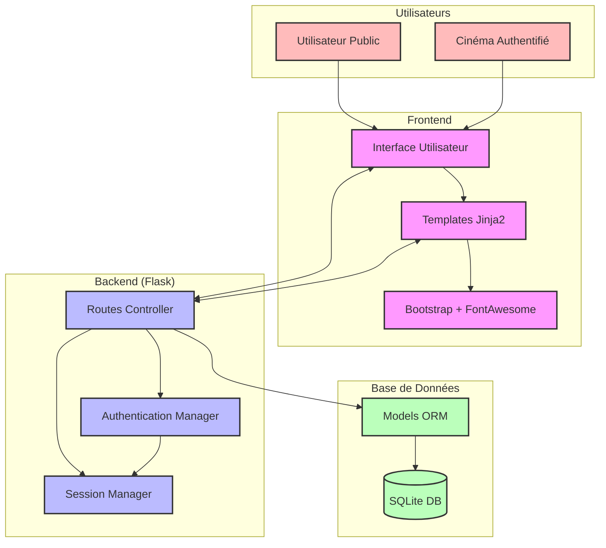
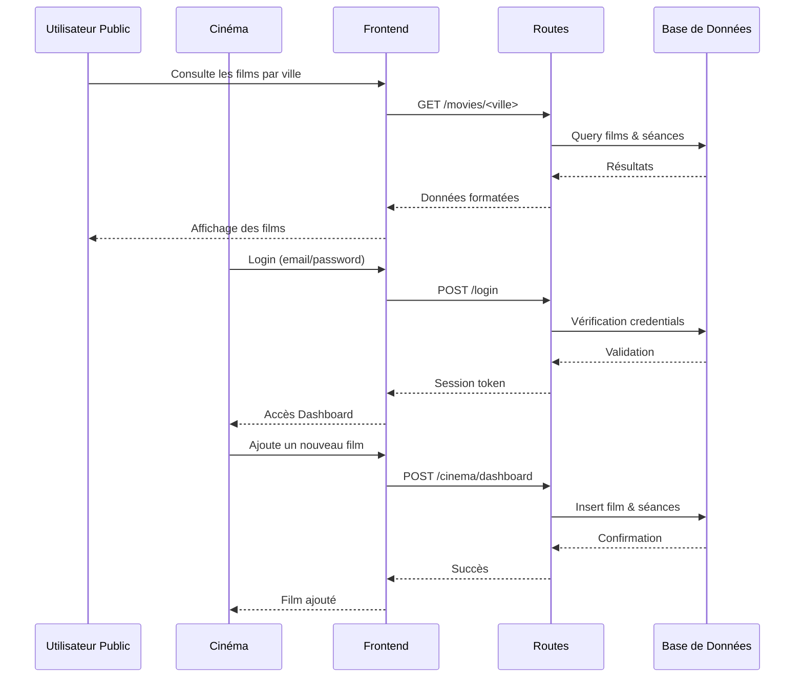

# Rapport Synthétique - Application de Gestion des Projections de Films

## Introduction
Cette application web permet aux cinémas parisiens de gérer leur programmation de films et aux utilisateurs de consulter les films à l'affiche. Elle est construite selon une architecture MVC (Modèle-Vue-Contrôleur) en utilisant le framework Flask.

## Schémas Fonctionnels

### Architecture Globale



### Flux des Cas d'Utilisation



## Architecture Technique

### 1. Structure du Projet
```
projet_rest/
├── app/                      # Package principal de l'application
│   ├── __init__.py          # Initialisation de l'application et des extensions
│   ├── models.py            # Modèles de données (ORM)
│   ├── routes.py            # Contrôleurs et points d'entrée API
│   ├── templates/           # Vues (templates Jinja2)
│   └── static/              # Fichiers statiques
├── venv/                    # Environnement virtuel Python
├── requirements.txt         # Dépendances du projet
├── .env                     # Variables d'environnement
└── README.md               
```

### 2. Composants Principaux

#### 2.1 Backend (Python/Flask)
- **Application Core** (`__init__.py`)
  - Configuration de l'application Flask
  - Initialisation de la base de données
  - Gestion de l'authentification
  - Configuration des variables d'environnement

- **Modèles de Données** (`models.py`)
  - `Cinema`: Gestion des informations des cinémas et authentification
  - `Movie`: Stockage des informations des films
  - `MovieSchedule`: Gestion des programmations et séances

- **Contrôleurs** (`routes.py`)
  - API REST pour la gestion des films
  - Endpoints pour l'authentification
  - Routes pour l'affichage des vues

#### 2.2 Frontend
- **Templates** (Jinja2 + Bootstrap 5)
  - `base.html`: Template de base avec navigation
  - `index.html`: Page d'accueil
  - `cinema_dashboard.html`: Interface d'administration des cinémas
  - `movie_list.html`: Liste des films par ville
  - `movie_details.html`: Détails d'un film
  - `login.html`: Page de connexion

### 3. Technologies Utilisées

#### 3.1 Backend
- **Flask** (v3.1.0)
  - Framework web léger et modulaire
  - Routing des requêtes HTTP
  - Gestion des sessions

- **SQLAlchemy** (v3.1.1)
  - ORM pour la gestion de la base de données
  - Mapping objet-relationnel
  - Abstraction de la base de données

- **Flask-Login** (v0.6.3)
  - Gestion de l'authentification
  - Sessions utilisateur
  - Protection des routes

#### 3.2 Frontend
- **Bootstrap** (v5.3.0)
  - Framework CSS responsive
  - Composants d'interface utilisateur
  - Grille flexible

- **Font Awesome** (v6.0.0)
  - Icônes vectorielles
  - Amélioration de l'interface utilisateur

#### 3.3 Base de Données
- **SQLite**
  - Base de données légère
  - Stockage local
  - Pas de configuration serveur nécessaire

### 4. Fonctionnalités Implémentées

#### 4.1 Espace Public
- Consultation des films par ville
- Affichage détaillé des informations des films
- Vue des horaires et lieux de projection
- Interface responsive et moderne

#### 4.2 Espace Cinéma (Authentifié)
- Système d'authentification sécurisé
- Gestion des films (ajout, programmation)
- Dashboard personnalisé
- Gestion des séances (dates, horaires, jours)

### 5. Sécurité
- Hachage des mots de passe avec Werkzeug
- Protection CSRF sur les formulaires
- Sessions sécurisées
- Variables d'environnement pour les données sensibles

### 6. Points d'Extension Possibles
- API REST complète pour l'intégration avec d'autres services
- Système de réservation de billets
- Gestion des images des films
- Système de notation et commentaires
- Internationalisation (i18n)

## Conclusion
L'application a été conçue avec une architecture modulaire et évolutive, permettant une maintenance facile et des extensions futures. L'utilisation de technologies modernes assure une expérience utilisateur optimale tout en maintenant une base de code propre et maintenable.